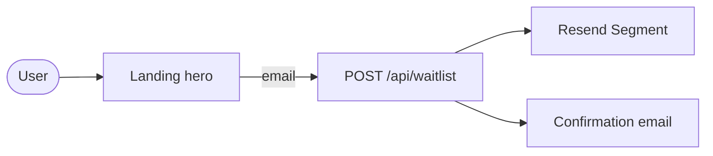
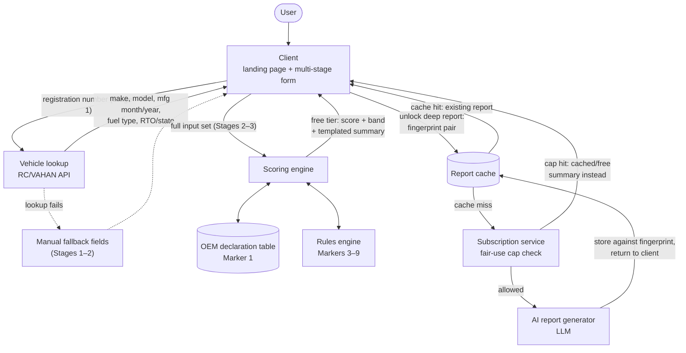
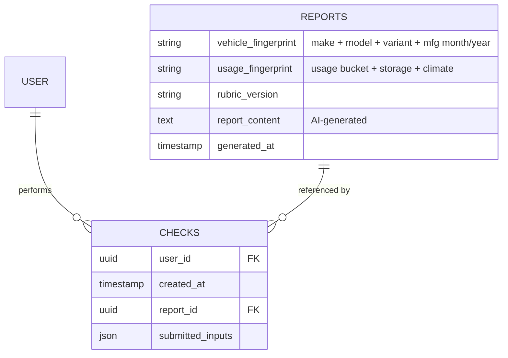

# DriveScore — System Architecture

Status: v1 draft (scoring path pre-build); **waitlist path implemented**  
Related: `01-landing-page.md`, `02-scoring-engine-rubric.md`, `03-multi-stage-form.md`, `04-ai-report-and-monetization.md`, `06-waitlist-and-email.md`

## Purpose

This doc describes how the pieces already specified (landing page, form, rubric, monetization) connect as a system — the request/data flow from a user landing on the page through to a generated report, and the data model that makes report caching actually work.

## Implemented today (`apps/web`)

| Component | Role |
| --------- | ---- |
| Landing client | Marketing page; hero waitlist form via TanStack Query |
| Waitlist API | `POST /api/waitlist` — validate email, upsert Resend Segment contact, send confirmation |
| Resend | Contact storage (Segment) + transactional confirmation email |
| PostHog | Client analytics (`/pulse` proxy); optional server HogQL for unique visitor count |

Details: `06-waitlist-and-email.md`, `apps/web/README.md`.

## Component overview (full product)

| Component            | Role                                                                                                                        | Status |
| -------------------- | --------------------------------------------------------------------------------------------------------------------------- | ------ |
| Client               | Landing page + multi-stage form (the only user-facing layer)                                                                | Landing live; form planned |
| Waitlist / email     | Resend Segment + confirmation email (`06`)                                                                                | **Live** |
| Vehicle lookup       | RC/VAHAN registration API integration — resolves registration number to make, model, manufacture date, fuel type, RTO/state | Planned |
| Scoring engine       | Computes the 10-marker score; wraps the rules engine (Markers 3–9 inference) and the OEM declaration table (Marker 1)       | Planned |
| Report cache         | Stores generated AI reports, keyed on vehicle + usage fingerprint — not per-user                                            | Planned |
| AI report generator  | LLM call that produces the paid deep report narrative; invoked only on a cache miss                                         | Planned |
| Subscription service | Gates access to fresh AI report generation; enforces the fair-use cap described in `04-ai-report-and-monetization.md`       | Planned |

## Request flow

### Pre-launch waitlist (live)

### Full product (planned)

1. **Client → Vehicle lookup.** User submits a registration number (Stage 1 of the form). The vehicle lookup service calls the RC/VAHAN API and returns make, model, manufacture month/year, fuel type, RTO/state. Falls back to manual entry (Stages 1–2 fallback fields) if the lookup fails.
2. **Client → Scoring engine.** Once Stage 2 (variant confirmation) and Stage 3 (usage & context) are complete, the client submits the full input set to the scoring engine.
3. **Scoring engine internals.** Marker 1 (OEM declaration) is checked against the OEM declaration table. Markers 3–9 are derived by the rules engine from manufacture date + variant + emission era. Marker 2 and Marker 10 come directly from lookup/user input. The engine returns: score, confidence band, per-marker breakdown, and an overall confidence rating.
4. **Scoring engine → Client (free tier).** The score, band, and a templated 1–2 line summary are returned immediately — no LLM call, no cost, this is the free experience described in `04-ai-report-and-monetization.md`.
5. **Client → Report cache (on "unlock deep report").** When a subscribed user requests the deep report, the system computes the vehicle fingerprint (make + model + variant + manufacture month/year) and usage fingerprint (usage bucket + storage pattern + climate), and checks the report cache for an existing match.
6. **Cache hit → Client.** If a report already exists for that fingerprint pair, it's returned directly. No AI generation cost.
7. **Cache miss → Subscription service → AI report generator.** The subscription service checks the user's fair-use cap before allowing a fresh generation. If allowed, the AI report generator produces the narrative from the structured marker breakdown + usage data, and the result is stored in the report cache against its fingerprint key before being returned to the client.

## Data model

**`checks` table** — one row per user check

- `user_id`
- `timestamp`
- `report_id` (foreign key → `reports`)
- vehicle/usage inputs as submitted (kept for audit/history even if they match an existing report)

**`reports` table** — one row per unique fingerprint pair

- `vehicle_fingerprint` (make + model + variant + manufacture month/year)
- `usage_fingerprint` (usage bucket + storage pattern + climate)
- `rubric_version` (the rubric version this report was generated under — see versioning policy in `02-scoring-engine-rubric.md`)
- AI-generated report content
- `generated_at`

This separation is the core cost-control mechanism: multiple `checks` rows can reference the same `reports` row. Ten users checking the same make/model/variant/year with similar usage share one stored report and one AI generation cost, not ten. See the diagrams above for the visual version of this relationship.

## Regeneration policy (system-level)

Carried over from `04-ai-report-and-monetization.md` for completeness at the architecture level:

- **Cache hit, same fingerprint** → serve existing report, no regeneration
- **Rubric version changes** → existing reports are NOT auto-regenerated; they're served as-is, tagged with their original `rubric_version`. Regeneration happens only on explicit user request.
- **OEM issues a new declaration for that model** → this invalidates Marker 1 for affected reports; treat as a targeted regeneration trigger for that specific vehicle fingerprint only, not a global cache flush.
- **Minor usage drift** (e.g. odometer inches toward but doesn't cross a bucket boundary) → still serve the cached report; not a regeneration trigger.

## Open items for build phase

- Choice of RC/VAHAN lookup API vendor (carried over from `03-multi-stage-form.md`) — affects the vehicle lookup component's reliability and the manual-fallback rate
- Define exact cache invalidation process for the "OEM issues new declaration" trigger — likely needs an admin/ops workflow, not just a code path
- Define subscription service's fair-use cap enforcement point precisely: checked before generation is attempted, with a clear user-facing message if the cap is hit (e.g. "you've used your fresh reports this period — here's your cached/free summary instead")
- Decide whether report cache lookups are exact-match only on fingerprint, or allow a "close enough" fuzzy match (e.g. usage bucket boundaries) — exact-match is simpler and recommended for v1
- Waitlist hardening (rate limit, double opt-in) — see out-of-scope in `06-waitlist-and-email.md`
- Infra beyond current Vercel + Resend + PostHog for the scoring path still TBD
