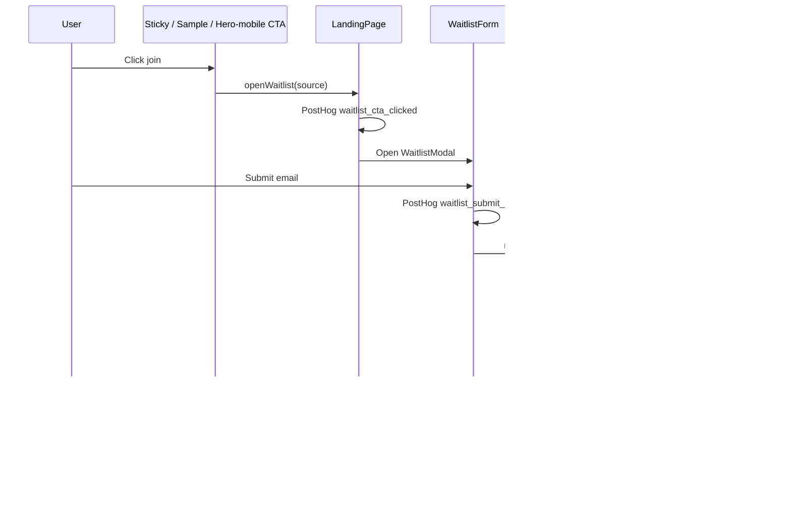

# DriveScore — Waitlist (stubbed)

Status: **implemented** in `apps/web`, email/CRM delivery **stubbed**  
Related: `01-landing-page.md`, `05-system-architecture.md`

## Purpose

Capture launch interest from the landing page hero. The API route validates and logs the email server-side (`console.log`) instead of calling an email/CRM provider — no confirmation email is sent and no contact is stored anywhere outside the server logs. This is intentional: the Resend integration (contact segment + confirmation email) was removed to keep the waitlist UI live without wiring a real provider.

## Flow

```mermaid
sequenceDiagram
  participant User
  participant CTA as Sticky / Sample / Hero-mobile CTA
  participant Page as LandingPage
  participant Form as WaitlistForm
  participant Hook as useJoinWaitlist
  participant API as POST_api_waitlist

  User->>CTA: Click join
  CTA->>Page: openWaitlist(source)
  Page->>Page: PostHog waitlist_cta_clicked
  Page->>Form: Open WaitlistModal
  User->>Form: Submit email
  Form->>Form: PostHog waitlist_submit_attempted
  Form->>Hook: mutate email
  Hook->>API: JSON email
  API->>API: Validate + normalize
  API->>API: console.log the email (stub)
  API-->>Hook: 200 ok
  Hook->>Hook: PostHog waitlist_joined
  Hook-->>Form: Success UI
```

There are two paths into the same hook, split by breakpoint — not both at once:

- **Modal path** — sticky CTA (bottom pill on mobile/tablet, top header on desktop), sample-score CTA, and the hero button *on mobile only*. Fires `waitlist_cta_clicked` first.
- **Inline path** — on desktop (≥768px) `landing.css` hides `.landing-hero__cta` and shows `.landing-hero__aside`, which renders a `WaitlistForm` directly. No modal, and no `waitlist_cta_clicked`.

So `waitlist_cta_clicked{source:"hero"}` fires on mobile only. Read hero conversion from `waitlist_submit_attempted{source:"hero"}` instead, which fires on both.

Both sticky CTA variants (`source: "sticky"` below 1024px, `source: "header"` at and above) are hidden until the user scrolls past the hero — see `hooks/use-scrolled-past.ts`, an `IntersectionObserver` on the hero section shared by `sticky-cta.tsx` and `sticky-header.tsx`.

## Implementation map

| Piece | Path |
| ----- | ---- |
| CTA sources + modal state (`hero` / `sample` / `sticky` / `header`) | `apps/web/src/components/landing/landing-page.tsx` |
| Modal shell | `apps/web/src/components/landing/ui/waitlist-modal.tsx` |
| **Form UI + submit** | `apps/web/src/components/landing/ui/waitlist-form.tsx` |
| Inline desktop hero variant of the form | `apps/web/src/components/landing/sections/hero.tsx` |
| Sticky bottom pill (mobile/tablet, CMS copy) | `apps/web/src/components/landing/sections/sticky-cta.tsx` |
| Sticky top header (desktop, hardcoded “Check your car”) | `apps/web/src/components/landing/sections/sticky-header.tsx` |
| Scroll-past-hero visibility hook, shared by both sticky variants | `apps/web/src/components/landing/hooks/use-scrolled-past.ts` |
| Breakpoint switch between the two hero paths | `apps/web/src/components/landing/styles/landing.css` |
| React Query mutation | `apps/web/src/hooks/use-join-waitlist.ts` |
| Client fetch helper | `apps/web/src/lib/waitlist-api.ts` |
| Query provider | `apps/web/src/components/providers/query-provider.tsx` |
| API route | `apps/web/src/app/api/waitlist/route.ts` |
| Email validation/normalization | `apps/web/src/lib/waitlist.ts` |

## Behavior

1. `WaitlistForm` validates email via HTML `required` + `type="email"`, fires `waitlist_submit_attempted`, then posts to `/api/waitlist`.
2. Server normalizes (trim + lowercase) and validates with a strict regex; `400` on invalid.
3. Server logs the normalized email (`console.log("[waitlist] join", email)`) and returns `{ ok: true }`. No contact is stored, no email is sent.
4. On success, client shows the joined UI and captures PostHog event `waitlist_joined` (email domain only).

## Environment variables

None required for the waitlist path itself — the previous `RESEND_API_KEY` / `RESEND_AUDIENCE_ID` / `RESEND_FROM_EMAIL` vars were removed along with the Resend integration.

Still required for analytics / site URL elsewhere:

| Variable | Purpose |
| -------- | ------- |
| `NEXT_PUBLIC_POSTHOG_KEY` | Client PostHog (analytics is client-only — there is no server-side PostHog call) |
| `NEXT_PUBLIC_SITE_URL` | Canonical / OG / sitemap base URL |

## Re-adding a real provider (later)

When ready to send real confirmation emails / store contacts again:

1. Pick a provider (Resend or otherwise) and add its SDK back to `apps/web/package.json`.
2. Replace the `console.log` in `apps/web/src/app/api/waitlist/route.ts` with the provider call(s).
3. Add the provider's env vars to `apps/web/.env.example` and Vercel.
4. Reintroduce a confirmation email template if the provider sends transactional email.

## Out of scope (later)

- Real email/CRM delivery (see above — currently stubbed to a console log)
- Double opt-in token links
- Admin UI / CSV export
- Welcome drip sequences
- Rate limiting (e.g. Upstash) if abused
