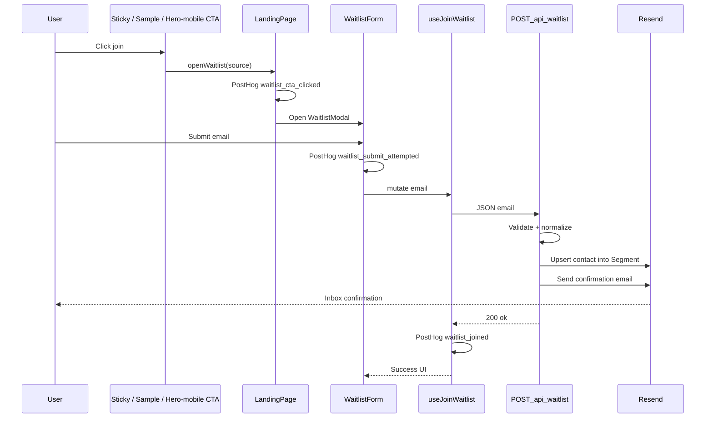

# DriveScore — Waitlist & Confirmation Email (Resend)

Status: **implemented** in `apps/web`  
Related: `01-landing-page.md`, `05-system-architecture.md`

## Purpose

Capture launch interest from the landing page hero, store the contact in Resend, and send a single opt-in confirmation email (“You’re on the waitlist”). No double opt-in click link in v1.

## Flow

```mermaid
sequenceDiagram
  participant User
  participant CTA as Sticky / Sample / Hero-mobile CTA
  participant Page as LandingPage
  participant Form as WaitlistForm
  participant Hook as useJoinWaitlist
  participant API as POST_api_waitlist
  participant Resend

  User->>CTA: Click join
  CTA->>Page: openWaitlist(source)
  Page->>Page: PostHog waitlist_cta_clicked
  Page->>Form: Open WaitlistModal
  User->>Form: Submit email
  Form->>Form: PostHog waitlist_submit_attempted
  Form->>Hook: mutate email
  Hook->>API: JSON email
  API->>API: Validate + normalize
  API->>Resend: Upsert contact into Segment
  API->>Resend: Send confirmation email
  Resend-->>User: Inbox confirmation
  API-->>Hook: 200 ok
  Hook->>Hook: PostHog waitlist_joined
  Hook-->>Form: Success UI
```

There are two paths into the same hook, split by breakpoint — not both at once:

- **Modal path** — sticky CTA, sample-score CTA, and the hero button *on mobile only*. Fires `waitlist_cta_clicked` first.
- **Inline path** — on desktop (≥768px) `landing.css` hides `.landing-hero__cta` and shows `.landing-hero__aside`, which renders a `WaitlistForm` directly. No modal, and no `waitlist_cta_clicked`.

So `waitlist_cta_clicked{source:"hero"}` fires on mobile only. Read hero conversion from `waitlist_submit_attempted{source:"hero"}` instead, which fires on both.

## Implementation map

| Piece | Path |
| ----- | ---- |
| CTA sources + modal state (`hero` / `sample` / `sticky`) | `apps/web/src/components/landing/landing-page.tsx` |
| Modal shell | `apps/web/src/components/landing/ui/waitlist-modal.tsx` |
| **Form UI + submit** | `apps/web/src/components/landing/ui/waitlist-form.tsx` |
| Inline desktop hero variant of the form | `apps/web/src/components/landing/sections/hero.tsx` |
| Breakpoint switch between the two hero paths | `apps/web/src/components/landing/styles/landing.css` |
| React Query mutation | `apps/web/src/hooks/use-join-waitlist.ts` |
| Client fetch helper | `apps/web/src/lib/waitlist-api.ts` |
| Query provider | `apps/web/src/components/providers/query-provider.tsx` |
| API route | `apps/web/src/app/api/waitlist/route.ts` |
| Resend helpers | `apps/web/src/lib/waitlist.ts` |
| Email template | `apps/web/src/lib/waitlist-email.ts` |

## Behavior

1. `WaitlistForm` validates email via HTML `required` + `type="email"`, fires `waitlist_submit_attempted`, then posts to `/api/waitlist`.
2. Server normalizes (trim + lowercase) and validates with a strict regex; `400` on invalid.
3. Contact is upserted into a Resend **Segment** (env `RESEND_AUDIENCE_ID` — Resend renamed Audiences → Segments).
4. Already-subscribed contacts are treated as success (idempotent join).
5. Confirmation email is sent from `RESEND_FROM_EMAIL` (plain text + simple HTML).
6. On success, client shows the joined UI and captures PostHog event `waitlist_joined` (email domain only).

## Environment variables

Set in `apps/web/.env.local` (see `apps/web/.env.example`):

| Variable | Purpose |
| -------- | ------- |
| `RESEND_API_KEY` | Resend API key |
| `RESEND_AUDIENCE_ID` | Segment ID for the Waitlist segment |
| `RESEND_FROM_EMAIL` | Verified sender, e.g. `DriveScore <hello@drivescore.club>` |

Also required for analytics / site URL elsewhere:

| Variable | Purpose |
| -------- | ------- |
| `NEXT_PUBLIC_POSTHOG_KEY` | Client PostHog (analytics is client-only — there is no server-side PostHog call) |
| `NEXT_PUBLIC_SITE_URL` | Canonical / OG / sitemap base URL, and the absolute image URL in the confirmation email |

## Resend + domain setup (production)

1. Create API key in Resend → `RESEND_API_KEY`.
2. Create a Segment named **Waitlist** → `RESEND_AUDIENCE_ID`.
3. Add and verify sending domain (e.g. `drivescore.club`) in Resend.
4. Add Resend DNS at the registrar (Porkbun for DriveScore):
   - TXT `resend._domainkey` (DKIM)
   - MX `send` → Resend/Amazon SES host (priority 10)
   - TXT `send` (SPF for sending subdomain)
   - Optional TXT `_dmarc`
5. Keep **root** MX/SPF for mailbox forwarding (e.g. Porkbun `fwd1`/`fwd2`) so `hello@` can still receive replies.
6. Set `RESEND_FROM_EMAIL=DriveScore <hello@drivescore.club>` and restart the app.
7. Mirror the same env vars in Vercel (or host) for production.

Local-only shortcut before domain verify: `RESEND_FROM_EMAIL=DriveScore <onboarding@resend.dev>` (delivers only to your Resend account email).

## Email content

Template: `apps/web/src/lib/waitlist-email.ts`  
Brand image (absolute URL): `{NEXT_PUBLIC_SITE_URL}/icons/icon-512.png` — the app icon. There is no separate email hero illustration.

- Subject: waitlist confirmed + E20 positioning
- HTML: ~640px light marketing layout — brand header, product pillars (free check, 10 markers, confidence bands, AI explains), CTA
- Plain-text alternative with the same beats
- Images require a publicly reachable `NEXT_PUBLIC_SITE_URL` (localhost URLs will break the image in the inbox)
- The email is light-mode only; it does not follow the site's `data-theme` switch

## Out of scope (later)

- Double opt-in token links
- Admin UI / CSV export beyond Resend dashboard
- Welcome drip sequences
- Rate limiting (e.g. Upstash) if abused
