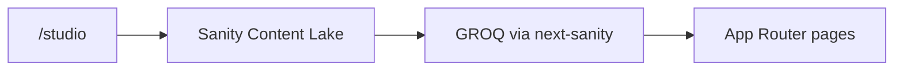

# DriveScore — Sanity CMS

Status: **implemented** in `apps/web`  
Related: `01-landing-page.md`, `05-system-architecture.md`, [`apps/web/README.md`](../apps/web/README.md)

## Purpose

All marketing and static page copy is authored in **Sanity**, not hardcoded in React. Presentation (layout, CSS, motion, waitlist logic) stays in the Next.js app; editors change text, FAQs, and legal/company pages in Studio without a redeploy for content-only updates (subject to the ~1 hour ISR cache).

This is a core integration for `apps/web`. Builds and runtime require a configured Sanity project with published documents.

## What lives in Sanity

| Document type | Pattern | Powers |
| ------------- | ------- | ------ |
| `siteSettings` | singleton (`siteSettings`) | Product name, default SEO title/description, contact email, footer disclaimer |
| `landingPage` | singleton (`landingPage`) | Hero, quick actions, problem, sample score, method display, confidence, FAQ chrome, sticky CTA, footer |
| `faqItem` | ordered documents | Landing FAQ accordion, `/faq`, FAQ JSON-LD, `llms-full.txt` |
| `companyPage` | documents by `slug` | `/privacy`, `/contact`, `/faq` intro (+ ready for future `terms` / `about`) |

Nested on `landingPage`: problem cards, sample markers, method slices (marketing display), confidence pointers, nav links.

## What does **not** live in Sanity

- Scoring engine / rubric truth — `METHOD_VERSION` in `apps/web/src/lib/method.ts` and future `packages/scoring-engine`
- Waitlist / Resend email templates
- PostHog analytics and visitor-count logic
- UI structure, tokens, and motion

CMS may show a `methodVersionLabel` for marketing; it is not the engine source of truth.

## Architecture

| Piece | Path |
| ----- | ---- |
| Studio config | `apps/web/sanity.config.ts` |
| Schemas / structure | `apps/web/src/sanity/schemas/`, `structure.ts` |
| Client + GROQ + fetch | `apps/web/src/sanity/lib/` |
| Embedded Studio | `apps/web/src/app/studio/[[...tool]]/page.tsx` → `/studio` |
| Consumers | `app/page.tsx`, `app/faq|privacy|contact`, landing sections, `lib/llms.ts` |

Server fetches use the Sanity API (CDN off) with optional `SANITY_API_READ_TOKEN`. Next.js caches responses with `revalidate: 3600` (~1 hour).

## Environment

Required:

- `NEXT_PUBLIC_SANITY_PROJECT_ID`

Commonly set:

- `NEXT_PUBLIC_SANITY_DATASET` (default `production`)
- `NEXT_PUBLIC_SANITY_API_VERSION` (default `2025-01-01`)
- `SANITY_API_READ_TOKEN` (recommended for reliable server reads)

See [`apps/web/.env.example`](../apps/web/.env.example). Mirror the same vars in Vercel for production.

## Setup checklist

1. Create a project + `production` dataset at [sanity.io/manage](https://www.sanity.io/manage).
2. Set env vars in `.env.local` / Vercel.
3. Add CORS origins for `http://localhost:3000` and the production host.
4. Run `pnpm dev` and open [http://localhost:3000/studio](http://localhost:3000/studio).
5. Ensure published documents exist for: Site settings, Landing page, FAQ items, and company pages (`privacy`, `contact`, `faq`).

Without project id or required documents, marketing routes fail at build/runtime (no in-repo content fallback).

## Editing content

1. `pnpm dev` in `apps/web`
2. Open `/studio` and sign in with a Sanity project member
3. Edit → **Publish**
4. Wait for the Next.js revalidation window (~1 hour), or redeploy, to see changes on the live site

## Agent / contributor notes

- Do not hardcode marketing copy in landing sections or company pages — extend schemas + GROQ + typed props instead.
- Prefer semantic design tokens for presentation; Sanity fields are content only.
- Keep rubric weights and scoring logic in code; only marketing blurbs/labels for the method section belong in CMS.
