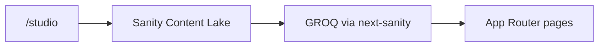

# DriveScore — Sanity CMS

Status: **implemented** in `apps/web`  
Related: `01-landing-page.md`, `05-system-architecture.md`, [`apps/web/README.md`](../apps/web/README.md)

## Purpose

All landing-page and FAQ copy is authored in **Sanity**, not hardcoded in React. Presentation (layout, CSS, motion, waitlist logic) stays in the Next.js app; editors change text and FAQs in Studio without a redeploy for content-only updates (subject to the ~1 hour ISR cache).

There are currently no standalone legal/company pages. `/privacy`, `/faq` and `/contact` were retired — the FAQ lives as a landing section, and `scripts/migrate-landing-copy.ts` deletes the legacy `companyPage` documents.

The only content route is `/`. The rest are `/studio`, `/api/waitlist`, and the generated files `/llms.txt`, `/llms-full.txt`, `/sitemap.xml`, `/robots.txt`, `/manifest.webmanifest`.

This is a core integration for `apps/web`. Builds and runtime require a configured Sanity project with published documents.

## What lives in Sanity

| Document type | Pattern | Powers |
| ------------- | ------- | ------ |
| `siteSettings` | singleton (`siteSettings`) | Product name, default SEO title/description, locale, footer disclaimer |
| `landingPage` | singleton (`landingPage`) | Header badge, hero, problem, journey, sample score, method display, confidence, FAQ chrome, sticky CTA, footer |
| `faqItem` | ordered documents | Landing FAQ accordion, FAQ JSON-LD, `llms-full.txt` |

Nested on `landingPage`: problem cards, journey steps, sample markers, method slices and markers, confidence pointers, nav links.

Several of these are load-bearing, not optional — `sanity/lib/fetch.ts` throws a named error if any array the landing components dereference is missing or empty. See the contributor notes below for the full list.

## What does **not** live in Sanity

- Scoring logic and the rubric of record — `METHOD_VERSION` in `apps/web/src/lib/method.ts` and `docs/02-scoring-engine-rubric.md`
- Waitlist / Resend email templates
- PostHog analytics
- UI structure, tokens, and motion

## The method weights are a CMS-authored mirror

One deliberate exception to the rule above. The method section's **tier shares** (`methodSlice.share`) and **all ten marker weights** (`methodMarker.weight`) are numeric fields authored in Studio, rendered from CMS in `sections/method.tsx`, and emitted into `/llms-full.txt` via `lib/llms.ts`.

They are a **display mirror of `docs/02-scoring-engine-rubric.md`, not the source of truth.** Nothing computes a score from them today, and when `packages/scoring-engine` lands it will read its weights from code, not from Sanity.

Guardrails in the schema:

- Every slice `share` and marker `weight` is required and constrained to 0–100
- `method.slices` must be present and non-empty, and each slice must carry at least one marker
- Slice shares must total exactly 100 — a publish-blocking error, because `method.tsx` renders a hardcoded “100%” composition label
- Marker weights within a slice should total that slice's share — a warning, so an in-progress edit isn't blocked

Editing a weight here changes what the site claims about its method while the rubric doc and `METHOD_VERSION` say something else. Change `docs/02` first, then mirror it here.

## Architecture



| Piece | Path |
| ----- | ---- |
| Studio config | `apps/web/sanity.config.ts` |
| Schemas / structure | `apps/web/src/sanity/schemas/`, `structure.ts` |
| Client + GROQ + fetch | `apps/web/src/sanity/lib/` |
| Embedded Studio | `apps/web/src/app/studio/[[...tool]]/page.tsx` → `/studio` |
| Consumers | `app/page.tsx`, landing sections, `lib/llms.ts` |

Server fetches use the Sanity API (CDN off) with optional `SANITY_API_READ_TOKEN`. Next.js caches responses with `revalidate: 3600` (~1 hour).

## Environment

Required:

- `NEXT_PUBLIC_SANITY_PROJECT_ID`

Commonly set:

- `NEXT_PUBLIC_SANITY_DATASET` (default `production`)
- `NEXT_PUBLIC_SANITY_API_VERSION` (default `2025-01-01`)
- `SANITY_API_READ_TOKEN` (recommended for reliable server reads)

See [`apps/web/.env.example`](../apps/web/.env.example). Mirror the same vars in Vercel for production.

## Setup checklist

1. Create a project + `production` dataset at [sanity.io/manage](https://www.sanity.io/manage).
2. Set env vars in `.env.local` / Vercel.
3. Add CORS origins for `http://localhost:3000` and the production host.
4. Run `pnpm dev` and open [http://localhost:3000/studio](http://localhost:3000/studio).
5. Ensure published documents exist for: Site settings, Landing page, and FAQ items.

Without project id or required documents, marketing routes fail at build/runtime (no in-repo content fallback).

## Editing content

1. `pnpm dev` in `apps/web`
2. Open `/studio` and sign in with a Sanity project member
3. Edit → **Publish**
4. Wait for the Next.js revalidation window (~1 hour), or redeploy, to see changes on the live site

## One-off migrations

From `apps/web`, with `SANITY_API_WRITE_TOKEN` in `.env.local` (Editor+):

```bash
pnpm migrate:sanity-copy              # dry-run
pnpm migrate:sanity-copy -- --apply   # write
```

`scripts/migrate-landing-copy.ts` renames `E20 Score` → `E20 report` across `landingPage` / `siteSettings` / `faqItem`, strips footer links to retired company routes, and deletes legacy `companyPage` docs for `privacy`, `faq`, and `contact`.

### Retired fields

These fields were authored and fetched but never rendered, so they were removed from the schema, GROQ query and types: `marqueeSuffix`, `hero.heroImageLight`, `hero.heroImageDark`, `hero.heroImageAlt`, `hero.stats` (and the `heroStat` object type), `journey.ctaLabel`, `journey.gaugeStartLabel`, `journey.gaugeEndLabel`, `method.methodVersionLabel`, `sampleScore.captionTemplate`, `siteSettings.contactEmail`.

Removing a field from the schema hides it in Studio but does **not** delete the stored values — any content already published under these keys is still in the dataset and will reappear if the field is re-added.

## Agent / contributor notes

- Do not hardcode marketing copy in landing sections — extend schemas + GROQ + typed props instead.
- Prefer semantic design tokens for presentation; Sanity fields are content only.
- Keep scoring logic in code. The method weights in CMS are a display mirror of `docs/02` (see above) — do not add any other numeric rubric data to Sanity.
- **A field is only "done" when something renders it.** Adding a field to the schema and the GROQ query but not to a component gives editors a Studio input that silently does nothing. If a field has no consumer yet, leave it out until it does.
- Conversely, a field is only safe if something guarantees it is populated. `sanity/lib/fetch.ts` throws a named error listing whichever of these is missing or empty, so a bad document fails with a useful message instead of crashing mid-render:

  `hero.titleAccent` · `hero.bullets` · `problem.cards` · `journey.titleAccent` · `journey.steps` · `sampleScore.imagePath` · `sampleScore.markers` · `method.slices` (and every slice's `markers`) · `confidence.pointers` · `footer.methodLinks`

  Add to that list whenever you render a CMS array or an image path without a guard.

### Known exceptions — copy still hardcoded in React

These render live English strings that editors cannot change, contrary to the rule above. The whole waitlist surface is hardcoded, which is the largest gap. All of it should move into `landingPage`.

| File | Hardcoded strings |
| --- | --- |
| `ui/waitlist-modal.tsx` | Title “Join the waitlist”; body “Be first to check your car's E20 report. Free first check — we'll email you at launch.”; success title “You're on the list”; success body “We'll email {email} when DriveScore launches. Your first check stays free.”; “Done”; aria-labels “Close waitlist dialog” / “Close” |
| `ui/waitlist-form.tsx` | Label “Email”; placeholder “you@email.com”; submit “Get early access”; loading “Joining…”; error fallback “Couldn't join — try again”; footnote “No spam · Unsubscribe anytime · Built for Indian cars” |
| `sections/hero.tsx` | The desktop aside card's title and body (duplicating the modal's) — the only hero copy desktop visitors see; the gauge tick labels E0–E25 |
| `sections/journey.tsx` | Trail image `alt`; aria-labels “Steps on the path” and “Step N: …”. Contrast `sampleScore`, which correctly uses a CMS `imageAlt` |
| `sections/sample-score.tsx` | The “Score” label on the score card |
| `sections/footer.tsx` | Column label “EXPLORE”; the “Built with ❤️ by Nischal Nikit” credit line and its LinkedIn URL |
| `sections/method.tsx` | The “100%” composition total (intentional — it is an invariant, enforced by the slice-share validation above) |
